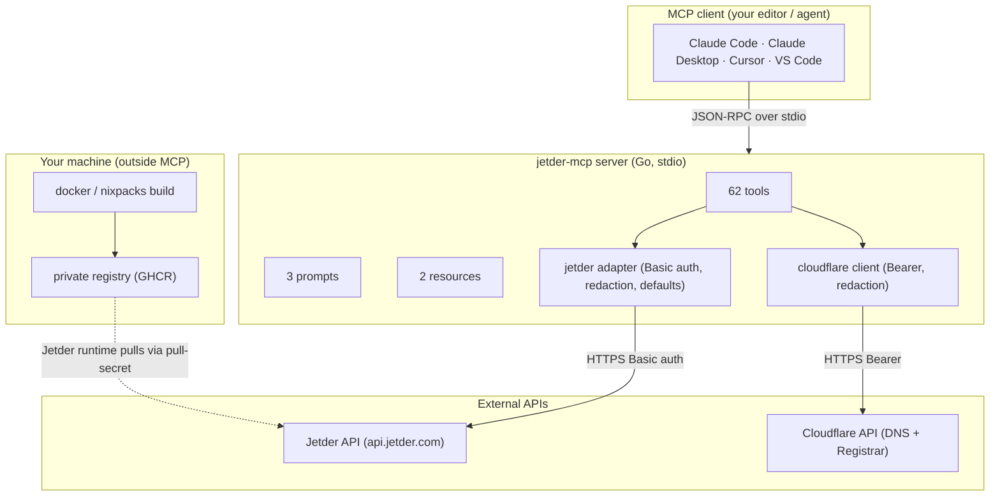
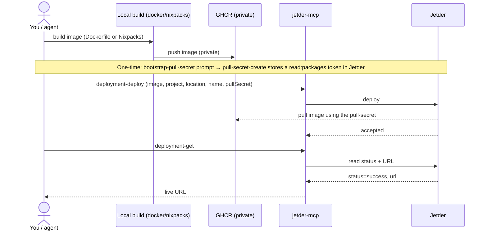
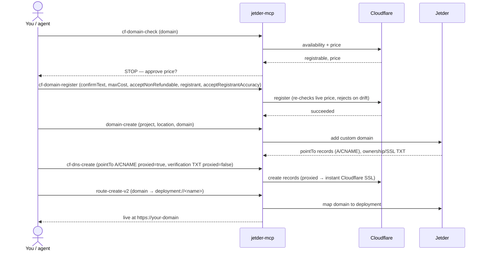
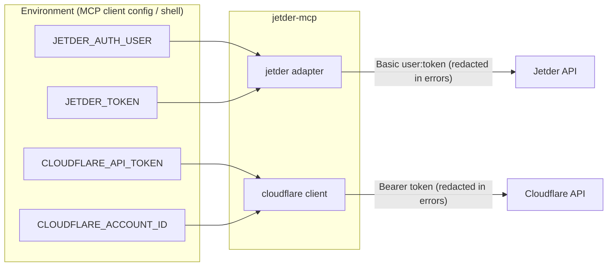

# Architecture

`jetder-mcp` is a single [MCP](https://modelcontextprotocol.io) server (Go, stdio)
that gives an AI agent **one** interface to deploy apps and manage domains: it wraps
the **Jetder** API (deployments, projects, secrets, …) and the **Cloudflare** API
(DNS + buying domains). An agent in Claude Code, Claude Desktop, Cursor, or VS Code
calls its **62 tools**, **3 guided prompts**, and **2 resources** — no dashboards,
no hand-written API calls.

It's built for two audiences: developers who want their agent to drive real infra,
and "vibe coders" who just want to say "deploy this and point my domain at it" and
have it happen safely.

## Overall architecture

The server reads JSON-RPC on stdin and writes on stdout — the client launches it as
a subprocess. Building and pushing a container image happens **on your machine**
(the server never builds); Jetder then pulls that image using a pull-secret stored
on the Jetder side (see [Git / GHCR](#what-the-git--ghcr-integration-does)).

## Deploy flow

## Buy + point a domain flow

## Credential / auth flow

Jetder needs `JETDER_AUTH_USER` + `JETDER_TOKEN` to start. Cloudflare is optional and
read lazily — without it, the `cf-*` tools report "not configured" and everything
else works. The full variable list is in [CREDENTIALS.md](./CREDENTIALS.md).

## Capabilities

Counts match the source: **62 tools, 3 prompts, 2 resources**.

### Jetder tools

| Area | Tools |
|------|-------|
| Identity | `me-get`, plus `jetder-auth` / `jetder-kyc` checks surfaced by `check-setup` |
| Location | `location-list`, `location-get` |
| Project | `project-list`, `project-get`, `project-usage` |
| Deployment (read) | `deployment-list`, `deployment-get`, `deployment-revisions`, `deployment-metrics` |
| Deployment (action) | `deployment-deploy`, `deployment-pause`, `deployment-resume`, `deployment-rollback` |
| Domain | `domain-create`, `domain-get`, `domain-list`, `domain-purge-cache` |
| Route | `route-create-v2`, `route-get`, `route-list` |
| Billing (read) | `billing-list`, `billing-get`, `billing-project-price` |
| Disk | `disk-list`, `disk-get`, `disk-create`, `disk-update` |
| Service account | `service-account-list`, `service-account-get`, `service-account-create`, `service-account-update`, `service-account-create-key` |
| Role | `role-list`, `role-get`, `role-users`, `role-permissions`, `role-create`, `role-grant` |
| Secret / pull-secret | `secret-list`, `secret-get`, `secret-create`, `pull-secret-list`, `pull-secret-get`, `pull-secret-create` |
| Workload identity | `workload-identity-list`, `workload-identity-get`, `workload-identity-create` |
| Organization | `organization-list`, `organization-get`, `organization-projects`, `organization-create`, `organization-update` |
| Email | `email-send` |
| Preflight | `check-setup` |

### Cloudflare tools

| Area | Tools |
|------|-------|
| Registrar (buy domains) | `cf-domain-search`, `cf-domain-check`, `cf-domain-register`, `cf-registration-status` |
| Zone / DNS | `cf-zone-lookup`, `cf-dns-list`, `cf-dns-create` |

### Prompts (guided playbooks)

- `deploy-an-app` — deploy an already-built private image (confirm pull-secret → deploy → read URL).
- `bootstrap-pull-secret` — one-time: create a `read:packages` token and store it in Jetder as a pull-secret.
- `point-a-domain` — point (and optionally buy) a custom domain at a deployment, end to end.

### Resources (read-only context)

- `jetder://status` — current readiness (auth / project / location / Cloudflare / pull-secret), with secrets and the account email masked.
- `jetder://help` — quick-start, required environment, and where to get access.

## What the Cloudflare integration does

With `CLOUDFLARE_API_TOKEN` (and `CLOUDFLARE_ACCOUNT_ID` for the Registrar):

- **Buy a domain** via Cloudflare Registrar — `cf-domain-search` / `cf-domain-check`
  (price source of truth) → `cf-domain-register`. The buy is **money-safe**: it needs
  an exact `confirmText`, a `maxRegistrationCost`, `acceptNonRefundable`, re-checks
  the live price, and rejects on any drift. A **registrant** (legal WHOIS) contact is
  supplied via the tool arg or `CLOUDFLARE_REGISTRANT_*` env, gated by
  `acceptRegistrantAccuracy`.
- **Manage DNS** — `cf-zone-lookup`, `cf-dns-list`, `cf-dns-create`. New `A`/`AAAA`/
  `CNAME` records default to **proxied** (orange cloud), so the site gets a valid
  **Cloudflare Universal SSL certificate immediately** — no browser TLS warning while
  the origin cert provisions. Verification `TXT` records stay DNS-only.

Setup: [CLOUDFLARE-SETUP.md](./CLOUDFLARE-SETUP.md) (token + Account ID walkthrough)
and [CREDENTIALS.md](./CREDENTIALS.md) (every variable).

## What the Git / GHCR integration does

The **MCP server reads no `GITHUB_TOKEN`** (or any GitHub env). GitHub/GHCR appear at
three distinct boundaries, and credentials — where needed — stay out of the server:

- **Install** — the binary is downloaded from public GitHub Releases (or `brew`); **no auth**.
- **Build & push (your machine)** — you build locally (`docker` or `nixpacks`) and push
  the image to a private registry (GHCR, or any registry). Pushing to a private registry
  **does** need a local registry credential (e.g. a `write:packages` token via
  `docker login`) — but that credential lives **only on your machine**; it is never read
  by the MCP server or sent to Jetder. The server does not build or push.
- **Runtime pull (Jetder)** — Jetder pulls your private image using a **pull-secret
  stored on the Jetder side** (named `ghcr-pull` by convention), created once with the
  `bootstrap-pull-secret` prompt → `pull-secret-create`. That `read:packages` token lives
  **on the Jetder side**, never as an env var on your machine.

See [DEPLOY.md](./DEPLOY.md) for the full build → push → deploy pipeline.

## Security model

- **Auth.** Jetder uses HTTP **Basic** auth (service-account email + token);
  Cloudflare uses **Bearer**. The two are independent.
- **Redaction.** Tokens, the username, the base64 `user:token` header, and the
  Cloudflare `Bearer` value are stripped from every error before it reaches the
  client. Resource content (e.g. `jetder://status`) is rendered through a masked
  view that never emits the account email or any secret.
- **PII.** The registrant contact is sent only to the registry; it is never echoed
  back and is redacted from errors.
- **Money safety.** Domain registration is fail-closed: explicit confirmation, a max
  cost, non-refundable acknowledgement, and a live price re-check before any spend.
- **Never-public images.** The sample/adopter deploy scripts (e.g. `deploy.sh`) enforce
  this — a preflight + post-push visibility check refuses to deploy a public image. The
  `mcp-deploy` helper itself does **not** check registry visibility; it only passes the
  image and pull-secret name to `deployment-deploy`.
- **Least exposure.** Destructive tools (`deployment-deploy`/`pause`/`rollback`,
  `cf-dns-create`, `cf-domain-register`, `domain-purge-cache`, `role-grant`,
  `service-account-create-key`, `email-send`) are annotated `destructiveHint:true`
  so clients can confirm before calling.
