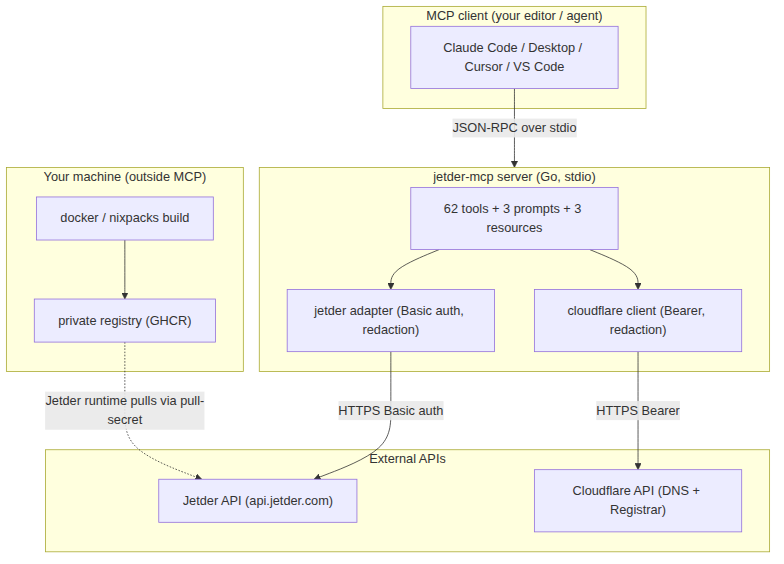
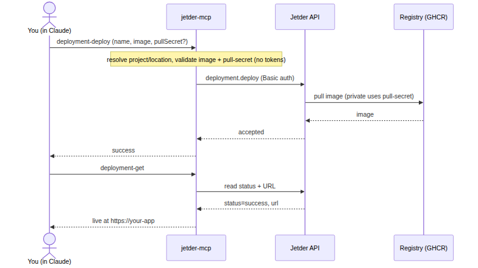
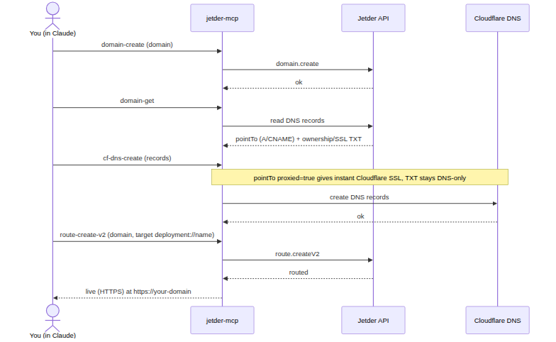

# Diagrams

Rendered flow images. The source `.mmd` files render live on GitHub; the `.png`
versions are embedded in the docs and handy for sharing (e.g. chat).

## Overall architecture

Source: [`architecture-overview.mmd`](./architecture-overview.mmd).

## Deploy flow

Source: [`deploy-flow.mmd`](./deploy-flow.mmd).

## Domain → route flow

Source: [`domain-route-flow.mmd`](./domain-route-flow.mmd). See
[ARCHITECTURE.md](../ARCHITECTURE.md) for the full set with live Mermaid.
